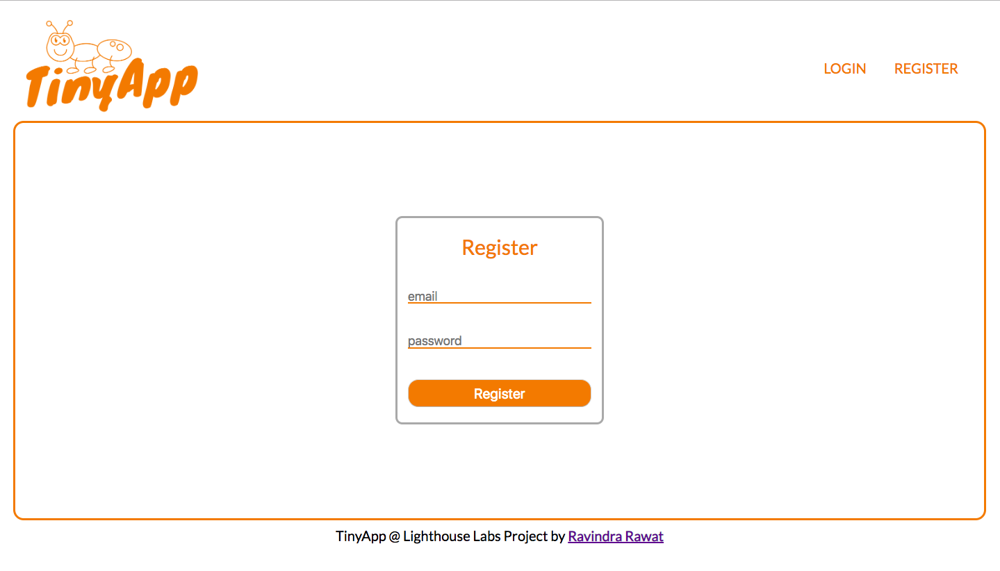
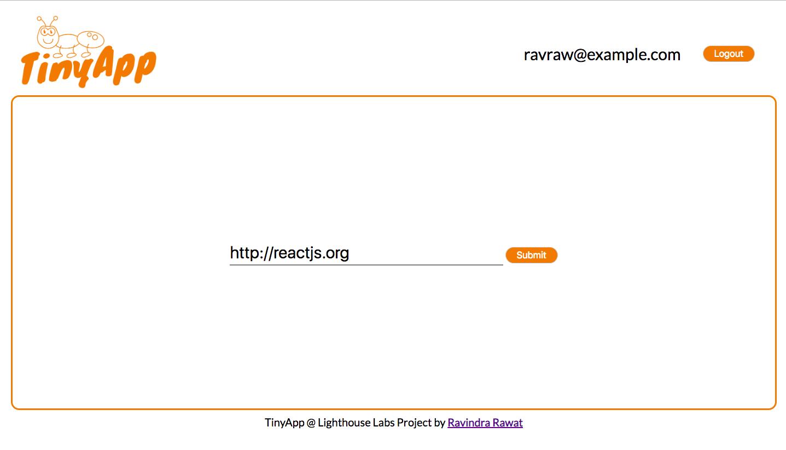
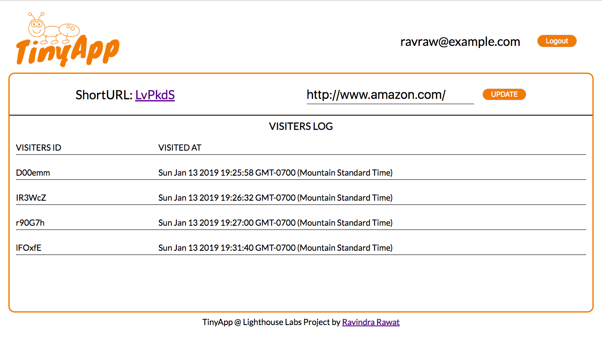
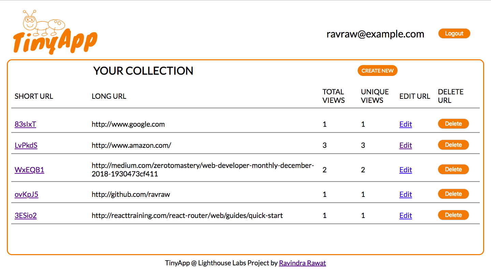

# TINY APP

Tiny app is a full stack web application built with Node and express that allows users to shorten long URLs

## Final Product.

## Dependencies

- Node.js
- Express
- EJS
- bcrypt
- body-parser
- cookie-session

## Getting started

-Install all dependencies (`js npm install`)
-Run the develompent web server using the (`node express_server.js`) command
